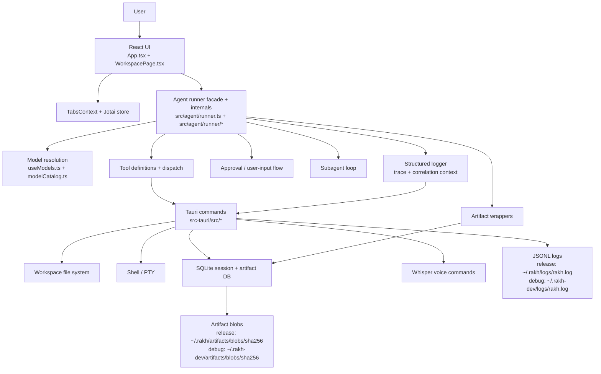

# Architecture

## Doc map

- [`docs/architecture.md`](./architecture.md): system overview, runtime flow, and code map
- [`docs/artifacts.md`](./artifacts.md): durable artifact model and validation flow
- [`docs/logging.md`](./logging.md): structured log schema, storage, and query/export APIs
- [`docs/subagents.md`](./subagents.md): subagent registry, contracts, and execution model

## Overview

Rakh is a Tauri desktop application with a React/Vite frontend and a Rust
backend. The UI manages multiple agent tabs. Each workspace tab owns isolated
Jotai state, its own chat history, and its own agent run loop.

The agent runtime uses the Vercel AI SDK for streaming model output, tool
calling, subagent delegation, MCP-backed dynamic tool registration, and
approval-driven execution against the local workspace. Session/artifact
persistence stays in SQLite, while session todos now live in a separate
JSON-backed store.

## Frontend architecture

### App shell

[`src/App.tsx`](../src/App.tsx) is the bootstrap layer. It:

- loads saved sessions from the Tauri SQLite backend
- loads configured providers from IndexedDB
- loads global MCP server configuration from the Tauri config store
- hydrates Jotai state before workspace tabs render
- applies theme mode and theme name to `<html>`
- auto-saves settled sessions and archives closed workspace tabs
- sends native notifications when an agent is waiting on approval or worktree input

[`src/contexts/TabsContext.tsx`](../src/contexts/TabsContext.tsx) manages the
tab strip independently from per-tab agent state. Tabs can be reordered,
restored, archived, and reopened without sharing agent state between tabs.

### Workspace surface

[`src/WorkspacePage.tsx`](../src/WorkspacePage.tsx) is the main runtime view.
It composes:

- chat history and streamed assistant output
- tool approval and user-input cards
- artifact pane views for plans, todos, review diffs, git, and durable artifacts
- integrated terminal via xterm.js + Tauri PTY
- optional voice input backed by the Rust Whisper commands

The artifact pane is push-driven. `useSessionArtifactInventory()` performs an
initial `artifactList()` fetch, then subscribes to backend `artifact_changed`
events through the Tauri event API and refreshes inventory only when matching
session artifacts change.

Chat bubbles now expose hover/focus actions implemented by
[`src/agent/chatBubbleActions.ts`](../src/agent/chatBubbleActions.ts):

- `Copy` serializes the visible bubble to markdown, including visible tool
  usage and cards, while omitting reasoning/thinking blocks
- `Fork` opens a new workspace tab rooted at that bubble boundary

Forking is intentionally asymmetric across persisted state:

- the new tab truncates `chatMessages` and `apiMessages` to the selected bubble
  boundary
- durable session artifacts are cloned into the new session so the artifact
  pane stays usable immediately
- todos are only preserved when the fork target is the latest visible bubble;
  earlier-bubble forks clear todos, plan state, review diffs, and usage ledger
  because Rakh does not persist historical snapshots for those derived stores

### State model

[`src/agent/atoms.ts`](../src/agent/atoms.ts) is the shared state boundary
between React and the non-React runner. The important pattern is
`atomFamily(tabId) -> AgentState`, which gives each workspace tab isolated:

- status and error state
- config (`cwd`, model, worktree metadata, advanced options)
- rendered chat messages
- live API message history used for the next model call
- plan and todos
- review diff snapshots
- debug and auto-approval flags

The shared `jotaiStore` lets the runner mutate atom state outside React while
components subscribe with fine-grained derived atoms from `useAgents.ts`.

`chatMessages` and `apiMessages` intentionally diverge:

- `chatMessages` remain the durable user-visible transcript
- `apiMessages` are runtime working memory used for the next model call

Manual context compaction relies on that split. `/compact` preserves the
visible `chatMessages` transcript, but after the compactor succeeds it rewrites
`apiMessages` down to:

1. a freshly rebuilt main-agent system prompt, including any saved project learned facts
2. one synthetic assistant message containing the compacted execution-state
   block

## Agent runtime

### Model and provider resolution

Provider instances are configured in Settings and stored in IndexedDB via
[`src/agent/db.ts`](../src/agent/db.ts). The model picker is built in
[`src/agent/useModels.ts`](../src/agent/useModels.ts):

- OpenAI and Anthropic models come from the static catalog in
  [`src/agent/models.catalog.json`](../src/agent/models.catalog.json)
- OpenAI-compatible providers contribute dynamic model entries from their cached
  `/models` response
- the runner resolves the selected UI model key through
  [`src/agent/modelCatalog.ts`](../src/agent/modelCatalog.ts)
- a model without `sdk_id` fails fast at run time

Environment-backed OpenAI and Anthropic keys are also read once from the Rust
backend with `load_provider_env_api_keys` and surfaced in Settings as quick-add
provider options.

### Turn lifecycle

[`src/agent/runner.ts`](../src/agent/runner.ts) is the public facade. The
main and subagent loops now live under
[`src/agent/runner/`](../src/agent/runner/).

High-level flow for a workspace turn:

1. append the user message to chat and API history
2. inject the system prompt on first turn, including runtime date/time context
3. resolve the selected provider/model and stream output with the AI SDK
4. accumulate visible text plus reasoning summaries
5. validate tool calls before asking for approval
6. pre-compute diff snapshots for file writes and edits before execution
7. execute tools or intercept subagent/user-input flows
8. append tool results as `tool` messages and continue until the model stops
   calling tools or the run limit is hit

Manual `/compact` follows a separate trigger path in the same runner facade:

1. detect the `/compact` slash command before the main-agent loop starts
2. require an existing main-agent system prompt and at least one non-system
   `apiMessage`
3. serialize the current internal state into one injected user payload with:
   - `system_prompt`
   - `messages`
   - `current_plan`
   - `todos`
   - `project_memory`
4. run the `compact` subagent with that payload as its only input
5. require exactly one markdown `compact-state` artifact
6. read the artifact body back from durable storage and verify the required
   compacted-history sections
7. atomically replace `apiMessages` with the refreshed system prompt plus the
   compacted assistant summary
8. append a visible assistant chat message with a summary card that renders the
   compacted markdown

Automatic context compaction reuses the same compactor subagent when the global
Context Compaction settings enable threshold-based auto-triggering. The runner
checks the live `apiMessages` size before a new main turn starts and between
main-agent iterations. When the configured percentage or KB threshold is
crossed, it runs the internal compactor, rewrites `apiMessages` to the
refreshed system prompt plus one compacted-history handoff message, keeps the
compactor's streamed turns visible in `chatMessages`, appends a final summary
card, and then resumes the main loop. Those
global settings are loaded at app startup from `config/compaction.json` and
include both the tool-IO compaction toggle and the automatic compactor
thresholds.

The compactor runs with visible subagent output enabled, so the chat transcript
shows its internal streaming/tool activity before the final summary card is
appended in both manual and automatic compaction flows.

The runner supports multiple concurrent tabs by keeping a separate abort
controller and run counter per tab.

### Structured logging

The runner and the backend command layer now share a structured log contract.
Frontend events are emitted through [`src/logging/client.ts`](../src/logging/client.ts),
which forwards entries to Tauri in desktop mode and falls back to structured
console output in plain web mode.

Trace propagation rules:

- each main agent run gets a dedicated `traceId` derived from the `runId`
- subagents derive child traces from the parent trace
- tool call ids become `correlationId`
- assistant message and stream lifecycle events attach to the same trace tree

This gives one JSONL timeline across runner lifecycle events, tool dispatch,
MCP transport, artifact persistence, and backend command execution.

### Tools, approvals, and review diffs

Tool schemas live in
[`src/agent/tools/definitions.ts`](../src/agent/tools/definitions.ts).
Execution is split between:

- runner-intercepted flows such as `agent_subagent_call` and `user_input`
- dispatched tools in
  [`src/agent/tools/index.ts`](../src/agent/tools/index.ts)

Current tool groups:

- `workspace_*`: list/stat/read/write/edit/glob/search
- `exec_run`
- `git_worktree_init`
- dynamically discovered `mcp_*` tools prepared per main-agent run
- `agent_todo_*`
- `agent_artifact_*`
- `agent_title_*`

Sensitive actions go through [`src/agent/approvals.ts`](../src/agent/approvals.ts).
That includes file edits, shell execution, worktree creation, and explicit user
input requests. MCP tool calls also go through the same approval path.

Review data is captured in two places:

- `ToolCallDisplay.originalDiffFiles`: the original proposed patch snapshot for
  the chat/tool UI
- `AgentState.reviewEdits`: per-file original-to-current diffs shown in the
  review pane

Todo state is now persisted outside the session DB in
`~/.rakh/sessions/todos/<sessionId>.json` (or `~/.rakh-dev/...` in debug
builds).

### Subagents and artifacts

Subagents are registered in
[`src/agent/subagents/index.ts`](../src/agent/subagents/index.ts) and run in a
private tool loop implemented by
[`src/agent/runner/subagentLoop.ts`](../src/agent/runner/subagentLoop.ts).

Artifacts are the durable output channel for plans, reviews, security reports,
context compaction summaries, and other structured handoffs. The detailed
contracts live in:

- [`docs/subagents.md`](./subagents.md)
- [`docs/artifacts.md`](./artifacts.md)

## Backend architecture

[`src-tauri/src/lib.rs`](../src-tauri/src/lib.rs) wires the application
together, registers plugins, creates shared app state, and exposes Tauri
commands from the backend modules.

Current backend modules:

- [`src-tauri/src/cli.rs`](../src-tauri/src/cli.rs): settings-managed `rakh`
  launcher install/status, PATH integration, and single-instance launch handoff
- [`src-tauri/src/db.rs`](../src-tauri/src/db.rs): session persistence, archived
  sessions, artifact manifests/blob helpers, artifact change event emission,
  and provider env key loading
- [`src-tauri/src/fs_ops.rs`](../src-tauri/src/fs_ops.rs): directory listing,
  stat, file reads/writes/deletes, glob, and grep-backed search
- [`src-tauri/src/exec.rs`](../src-tauri/src/exec.rs): command execution,
  timeout handling, stdout/stderr capture, abort/stop controls
- [`src-tauri/src/pty.rs`](../src-tauri/src/pty.rs): interactive terminal PTY
  lifecycle used by the xterm.js terminal
- [`src-tauri/src/git.rs`](../src-tauri/src/git.rs): worktree creation command
- [`src-tauri/src/todos.rs`](../src-tauri/src/todos.rs): JSON-backed todo
  store and tracked mutation history
- [`src-tauri/src/logging.rs`](../src-tauri/src/logging.rs): JSONL log store,
  rotation, query/export/clear commands, and `log_entry` event emission
- [`src-tauri/src/mcp.rs`](../src-tauri/src/mcp.rs): global MCP config
  persistence plus per-run MCP transport/session management
- [`src-tauri/src/whisper.rs`](../src-tauri/src/whisper.rs): local Whisper
  model download/preparation and WAV transcription
- [`src-tauri/src/shell_env.rs`](../src-tauri/src/shell_env.rs): login-shell
  environment discovery helpers
- [`src-tauri/src/utils.rs`](../src-tauri/src/utils.rs): shared helpers

The backend already uses Tauri events for streaming-style UI updates. PTY and
exec output are emitted as app events, and artifact writes now emit an
`artifact_changed` event after successful create/version persistence so the
frontend can refresh the artifact pane without polling.

Structured logging uses the same event channel pattern. Every successful write
also emits a `log_entry` event so future log viewers or diagnostics panes can
tail new entries without polling.

## Persistence and storage

Rakh persists data in multiple places by design:

- provider instances: browser IndexedDB (`rakh-providers`)
- theme mode, theme name, selected model, and some UI preferences: localStorage
- global MCP server registry + MCP settings: `~/.rakh/config/mcp_servers.json`
  or `~/.rakh-dev/config/mcp_servers.json`
- global context compaction settings: `~/.rakh/config/compaction.json`
  or `~/.rakh-dev/config/compaction.json`
  - stores `toolContextCompactionEnabled` and `autoContextCompaction`
- release sessions and artifact manifests: `~/.rakh/sessions/sessions.db`
- debug/dev sessions and artifact manifests: `~/.rakh-dev/sessions/sessions.db`
- release todo files: `~/.rakh/sessions/todos/<sessionId>.json`
- debug/dev todo files: `~/.rakh-dev/sessions/todos/<sessionId>.json`
- release artifact content blobs: `~/.rakh/artifacts/blobs/sha256`
- debug/dev artifact content blobs: `~/.rakh-dev/artifacts/blobs/sha256`
- release git worktrees created by the agent: `~/.rakh/worktrees/<owner>/<repo>/<branch>`
- debug/dev git worktrees created by the agent: `~/.rakh-dev/worktrees/<owner>/<repo>/<branch>`
- release structured logs: `~/.rakh/logs/rakh.log`
- debug/dev structured logs: `~/.rakh-dev/logs/rakh.log`

Session persistence is front-to-back:

- the frontend snapshots `AgentState` in
  [`src/agent/persistence.ts`](../src/agent/persistence.ts)
- the Rust backend stores it in SQLite through
  [`src-tauri/src/db.rs`](../src-tauri/src/db.rs)
- `App.tsx` restores it on startup and rehydrates the matching Jotai atoms

Todo persistence is a parallel path:

- the backend todo store in [`src-tauri/src/todos.rs`](../src-tauri/src/todos.rs)
  is the source of truth
- the frontend hydrates todo state from that JSON store during session restore
- SQLite session rows do not persist todo state

Bubble forks create a new todo-store file for the forked session. When the fork
targets the latest bubble, the current todo list is copied into that new file.
When the fork targets an earlier bubble, the new todo file starts empty for the
same reason earlier-bubble plan/review state is cleared: historical snapshots do
not exist for those stores.

Closed workspace tabs are archived, not deleted, unless the session is still
empty.

## Code map

Top-level folders worth knowing:

- `src/`: React UI, agent runtime, tooling wrappers, state, and styles
- `src/components/`: workspace UI, terminal, settings, artifact pane, and UI primitives
- `src/agent/`: runner, atoms, persistence, providers, models, tools, subagents
- `src/styles/`: tokens, themes, layout, and component styles
- `src-tauri/src/`: Rust commands and platform integration
- `docs/`: architecture, artifact, logging, and subagent documentation

## Testing map

- frontend tests: `src/**/*.test.ts` via `npm run test`
- full frontend + Rust pass: `npm run test:all`
- Rust tests: `cd src-tauri && cargo test`
