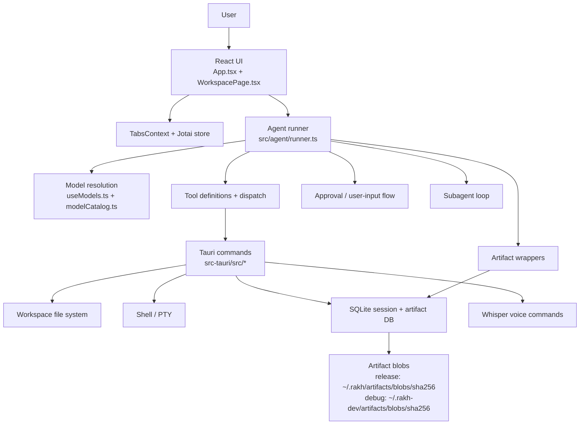

# Architecture

## Doc map

- [`docs/architecture.md`](./architecture.md): system overview, runtime flow, and code map
- [`docs/artifacts.md`](./artifacts.md): durable artifact model and validation flow
- [`docs/subagents.md`](./subagents.md): subagent registry, contracts, and execution model

## Overview

Rakh is a Tauri desktop application with a React/Vite frontend and a Rust
backend. The UI manages multiple agent tabs. Each workspace tab owns isolated
Jotai state, its own chat history, and its own agent run loop.

The agent runtime uses the Vercel AI SDK for streaming model output, tool
calling, subagent delegation, and approval-driven execution against the local
workspace.



## Frontend architecture

### App shell

[`src/App.tsx`](../src/App.tsx) is the bootstrap layer. It:

- loads saved sessions from the Tauri SQLite backend
- loads configured providers from the Tauri backend (`providers_load`)
- hydrates Jotai state before workspace tabs render
- applies theme mode and theme name to `<html>`
- auto-saves settled sessions and archives closed workspace tabs
- sends native notifications when an agent is waiting on approval or worktree input

[`src/contexts/TabsContext.tsx`](../src/contexts/TabsContext.tsx) manages the
tab strip independently from per-tab agent state. Tabs can be reordered,
restored, archived, and reopened without sharing agent state between tabs.

### Workspace surface

[`src/WorkspacePage.tsx`](../src/WorkspacePage.tsx) is the main runtime view.
It composes:

- chat history and streamed assistant output
- tool approval and user-input cards
- artifact pane views for plans, todos, review diffs, git, and durable artifacts
- integrated terminal via xterm.js + Tauri PTY
- optional voice input backed by the Rust Whisper commands

The artifact pane is push-driven. `useSessionArtifactInventory()` performs an
initial `artifactList()` fetch, then subscribes to backend `artifact_changed`
events through the Tauri event API and refreshes inventory only when matching
session artifacts change.

### State model

[`src/agent/atoms.ts`](../src/agent/atoms.ts) is the shared state boundary
between React and the non-React runner. The important pattern is
`atomFamily(tabId) -> AgentState`, which gives each workspace tab isolated:

- status and error state
- config (`cwd`, model, worktree metadata, advanced options)
- rendered chat messages
- full API message history
- plan and todos
- review diff snapshots
- debug and auto-approval flags

The shared `jotaiStore` lets the runner mutate atom state outside React while
components subscribe with fine-grained derived atoms from `useAgents.ts`.

## Agent runtime

### Model and provider resolution

Provider instances are configured in Settings and persisted to disk via
[`src/agent/db.ts`](../src/agent/db.ts), which calls the Rust backend commands
`providers_load` and `providers_save` from
[`src-tauri/src/db.rs`](../src-tauri/src/db.rs). The model picker is built in
[`src/agent/useModels.ts`](../src/agent/useModels.ts):

- OpenAI and Anthropic models come from the static catalog in
  [`src/agent/models.catalog.json`](../src/agent/models.catalog.json)
- OpenAI-compatible providers contribute dynamic model entries from their cached
  `/models` response
- the runner resolves the selected UI model key through
  [`src/agent/modelCatalog.ts`](../src/agent/modelCatalog.ts)
- a model without `sdk_id` fails fast at run time

Environment-backed OpenAI and Anthropic keys are also read once from the Rust
backend with `load_provider_env_api_keys` and surfaced in Settings as quick-add
provider options.

### Turn lifecycle

[`src/agent/runner.ts`](../src/agent/runner.ts) owns the main loop.

High-level flow for a workspace turn:

1. append the user message to chat and API history
2. inject the system prompt on first turn, including runtime date/time context
3. resolve the selected provider/model and stream output with the AI SDK
4. accumulate visible text plus reasoning summaries
5. validate tool calls before asking for approval
6. pre-compute diff snapshots for file writes and edits before execution
7. execute tools or intercept subagent/user-input flows
8. append tool results as `tool` messages and continue until the model stops
   calling tools or the run limit is hit

The runner supports multiple concurrent tabs by keeping a separate abort
controller and run counter per tab.

### Tools, approvals, and review diffs

Tool schemas live in
[`src/agent/tools/definitions.ts`](../src/agent/tools/definitions.ts).
Execution is split between:

- runner-intercepted flows such as `agent_subagent_call` and `user_input`
- dispatched tools in
  [`src/agent/tools/index.ts`](../src/agent/tools/index.ts)

Current tool groups:

- `workspace_*`: list/stat/read/write/edit/glob/search
- `exec_run`
- `git_worktree_init`
- `agent_todo_*`
- `agent_artifact_*`
- `agent_title_*`

Sensitive actions go through [`src/agent/approvals.ts`](../src/agent/approvals.ts).
That includes file edits, shell execution, worktree creation, and explicit user
input requests.

Review data is captured in two places:

- `ToolCallDisplay.originalDiffFiles`: the original proposed patch snapshot for
  the chat/tool UI
- `AgentState.reviewEdits`: per-file original-to-current diffs shown in the
  review pane

### Project commands and setup scripts

Each workspace project can define a setup command and custom command shortcuts
via a project-scoped config file. The config lives at
`<project-root>/.rakh/scripts.json` and is managed through the Project Settings
modal (gear icon in the workspace header).

[`src/projectScripts.ts`](../src/projectScripts.ts) defines the schema:

```json
{
  "setupCommand": "npm install",
  "commands": [
    { "id": "build", "label": "Build", "command": "npm run build", "icon": "hammer", "showLabel": true }
  ]
}
```

- `setupCommand`: optional shell command run automatically after git worktree
  creation for that project
- `commands`: array of shortcuts displayed in the Project Command Bar
  (toggle with `Cmd+B`). Each command has an id, label, shell command, optional
  icon, and showLabel flag.

[`src/projects.ts`](../src/projects.ts) handles resolution:

1. Saved projects (path + name) are stored in localStorage (`rakh-projects`)
2. On load, `resolveSavedProject()` checks for `.rakh/scripts.json`
3. If the config file exists, its `setupCommand` and `commands` take precedence
   over any values in localStorage, and `hasProjectConfigFile` is set to `true`
4. The Project Settings modal writes directly to `.rakh/scripts.json` when
   `hasProjectConfigFile` is true, otherwise falls back to localStorage

The Project Command Bar ([`src/components/ProjectCommandBar.tsx`](../src/components/ProjectCommandBar.tsx))
renders the shortcuts and runs them in the integrated terminal when clicked.

### Subagents and artifacts

Subagents are registered in
[`src/agent/subagents/index.ts`](../src/agent/subagents/index.ts) and run in a
private tool loop inside the main runner.

Artifacts are the durable output channel for plans, reviews, security reports,
and other structured handoffs. The detailed contracts live in:

- [`docs/subagents.md`](./subagents.md)
- [`docs/artifacts.md`](./artifacts.md)

## Backend architecture

[`src-tauri/src/lib.rs`](../src-tauri/src/lib.rs) wires the application
together, registers plugins, creates shared app state, and exposes Tauri
commands from the backend modules.

Current backend modules:

- [`src-tauri/src/db.rs`](../src-tauri/src/db.rs): session persistence, archived
  sessions, artifact manifests/blob helpers, artifact change event emission,
  and provider env key loading
- [`src-tauri/src/fs_ops.rs`](../src-tauri/src/fs_ops.rs): directory listing,
  stat, file reads/writes/deletes, glob, and grep-backed search
- [`src-tauri/src/exec.rs`](../src-tauri/src/exec.rs): command execution,
  timeout handling, stdout/stderr capture, abort/stop controls
- [`src-tauri/src/pty.rs`](../src-tauri/src/pty.rs): interactive terminal PTY
  lifecycle used by the xterm.js terminal
- [`src-tauri/src/git.rs`](../src-tauri/src/git.rs): worktree creation command
- [`src-tauri/src/whisper.rs`](../src-tauri/src/whisper.rs): local Whisper
  model download/preparation and WAV transcription
- [`src-tauri/src/shell_env.rs`](../src-tauri/src/shell_env.rs): login-shell
  environment discovery helpers
- [`src-tauri/src/utils.rs`](../src-tauri/src/utils.rs): shared helpers

The backend already uses Tauri events for streaming-style UI updates. PTY and
exec output are emitted as app events, and artifact writes now emit an
`artifact_changed` event after successful create/version persistence so the
frontend can refresh the artifact pane without polling.

## Persistence and storage

Rakh persists data in multiple places by design:

- provider instances: `~/.rakh/config/providers.json` (debug: `~/.rakh-dev/config/providers.json`),
  managed via `providers_load` / `providers_save` Tauri commands
- theme mode, theme name, selected model, and some UI preferences: localStorage
- release sessions and artifact manifests: `~/.rakh/sessions/sessions.db`
- debug/dev sessions and artifact manifests: `~/.rakh-dev/sessions/sessions.db`
- release artifact content blobs: `~/.rakh/artifacts/blobs/sha256`
- debug/dev artifact content blobs: `~/.rakh-dev/artifacts/blobs/sha256`
- release git worktrees created by the agent: `~/.rakh/worktrees/<owner>/<repo>/<branch>`
- debug/dev git worktrees created by the agent: `~/.rakh-dev/worktrees/<owner>/<repo>/<branch>`
- project list (path + name): localStorage (`rakh-projects`)
- per-project setup commands and shortcuts: `<project-root>/.rakh/scripts.json` (checked
  on project load, takes precedence over localStorage values)

Session persistence is front-to-back:

- the frontend snapshots `AgentState` in
  [`src/agent/persistence.ts`](../src/agent/persistence.ts)
- the Rust backend stores it in SQLite through
  [`src-tauri/src/db.rs`](../src-tauri/src/db.rs)
- `App.tsx` restores it on startup and rehydrates the matching Jotai atoms

Closed workspace tabs are archived, not deleted, unless the session is still
empty.

## Code map

Top-level folders worth knowing:

- `src/`: React UI, agent runtime, tooling wrappers, state, and styles
- `src/components/`: workspace UI, terminal, settings, artifact pane, and UI primitives
- `src/agent/`: runner, atoms, persistence, providers, models, tools, subagents
- `src/projects.ts`: saved project list, project config resolution, localStorage sync
- `src/projectScripts.ts`: `.rakh/scripts.json` schema, normalization, read/write helpers
- `src/styles/`: tokens, themes, layout, and component styles
- `src-tauri/src/`: Rust commands and platform integration
- `docs/`: architecture, artifact, and subagent documentation

## Testing map

- frontend tests: `src/**/*.test.ts` via `npm run test`
- full frontend + Rust pass: `npm run test:all`
- Rust tests: `cd src-tauri && cargo test`
